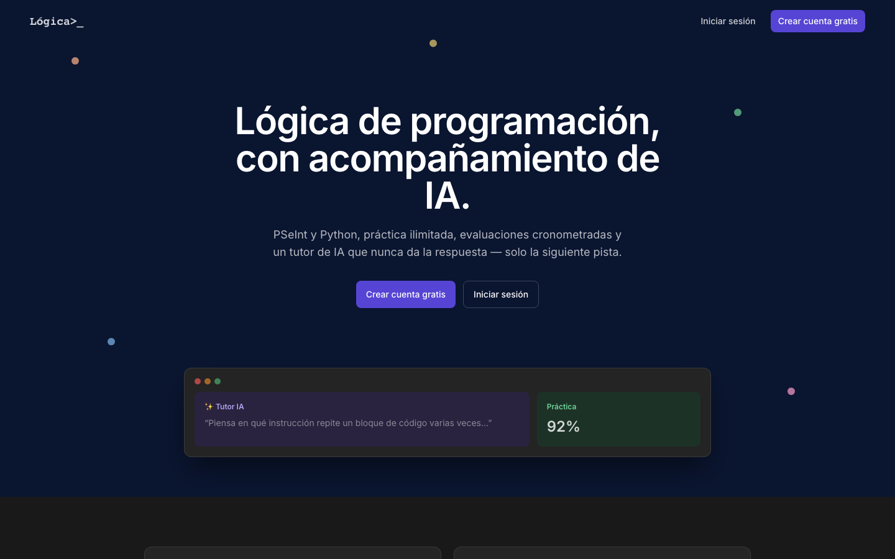
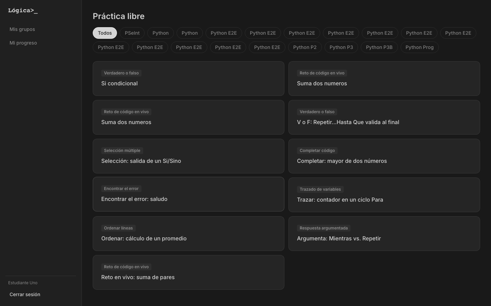
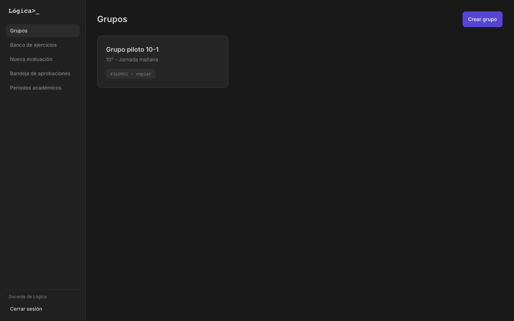
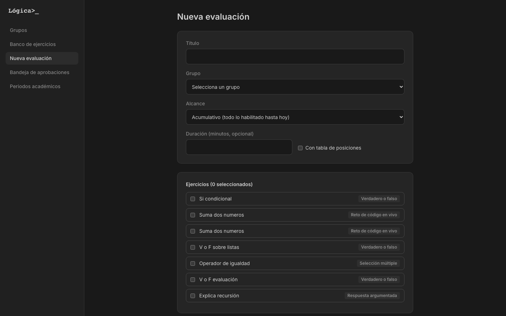
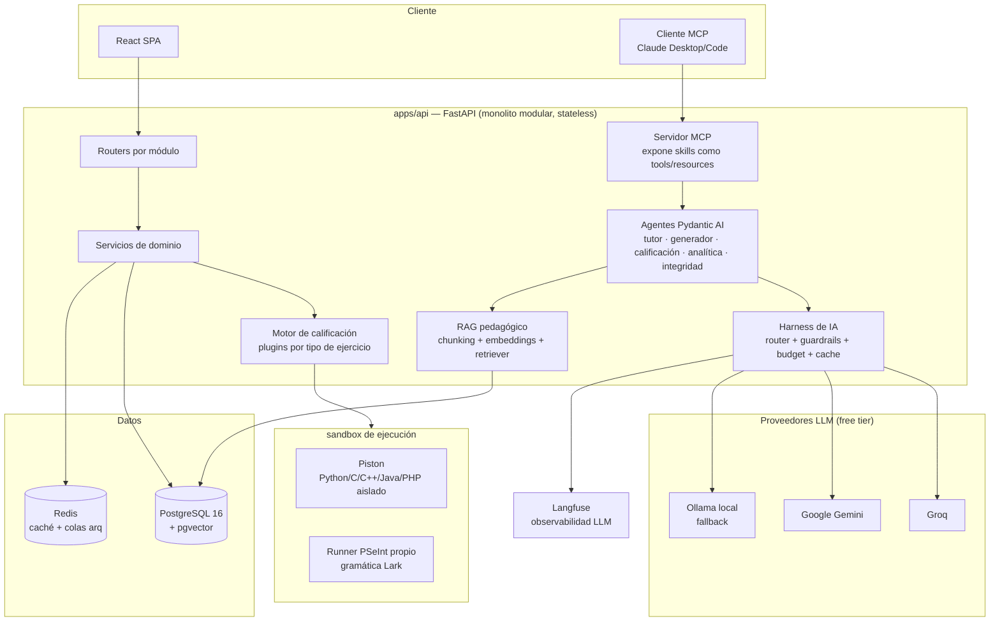

# CodeMentor

[](https://github.com/Juanpacol/CodeMentor-/actions/workflows/ci.yml)

Plataforma web de lógica de programación (PSeInt y Python) para el **INEM José Félix de Restrepo** (Medellín) — y, a la vez, un proyecto de referencia de **AI Engineering**: harness de modelos con enrutamiento y fallback, RAG pedagógico, agentes con supervisión humana obligatoria, skills reutilizables expuestas también vía **MCP**, evals y observabilidad de IA. Construido 100% con herramientas gratuitas u open-source, del backend al despliegue.

## Capturas

| Landing | Práctica libre (estudiante) |
|---|---|
|  |  |

| Grupos (docente) | Constructor de evaluaciones |
|---|---|
|  |  |

## Por qué este proyecto

Nace del [documento de requerimientos](docs/requerimientos.md) real de una institución educativa pública, y se implementa como un sistema profesional completo: no solo CRUD y autenticación, sino el ciclo completo de **AI Engineering** aplicado a un dominio con restricciones reales (menores de edad, cero presupuesto, conectividad intermitente, el docente siempre al mando del contenido).

## Arquitectura

Monolito modular stateless en FastAPI + PostgreSQL/pgvector + Redis, con el sandbox de ejecución de código y el servidor MCP como procesos aislados desde el día 1. Ver [`docs/arquitectura.md`](docs/arquitectura.md) para el detalle completo y [ADR-001](docs/adr/001-monolito-modular.md) para la justificación de esta decisión.



**Stack**: Python 3.12 · FastAPI · SQLAlchemy 2 (async) · Alembic · PostgreSQL 16 + pgvector · Redis + arq · LiteLLM (Groq / Gemini / Ollama con fallback) · Pydantic AI · sentence-transformers · Piston (sandbox) · Langfuse · MCP SDK · React 19 + Vite + TypeScript + Tailwind v4 + TanStack Query + Playwright.

## Funcionalidades destacadas

- **8 tipos de ejercicio** (verdadero/falso, selección múltiple, completar código, encontrar el error, trazado de variables, ordenar líneas, respuesta argumentada, reto de código en vivo) calificados por un motor de plugins — agregar un noveno tipo es una clase nueva, no tocar el resto (RE-05).
- **Tutor de IA con RAG**: pistas progresivas fundamentadas en el material real del curso, nunca la respuesta directa — y con degradación amable a un aviso claro si los proveedores de IA no están disponibles, en vez de romper la app.
- **5 agentes de IA supervisados**: tutor, generador de ejercicios, sugerencia de calificación, resumen de analítica y alertas de integridad — todos con aprobación humana obligatoria antes de tener efecto real (RF-30..35).
- **Evaluaciones cronometradas** con alcance explícito (fijo hasta un tema o acumulativo), autosave, cronómetro server-authoritative y ranking opcional.
- **Reportes exportables** (xlsx/pdf) generados de forma asíncrona, seguimiento de progreso con insignias y detección de estudiantes rezagados.
- **Servidor MCP**: las mismas skills quedan expuestas como tools/resources para conectar Claude Desktop o Claude Code directamente a los datos de un docente (`docs/adr/005-mcp-server-dentro-de-apps-api.md`).
- **Hardening de producción**: rate limiting, cabeceras de seguridad, escaneo estático (bandit/pip-audit) en CI — ver [`docs/despliegue.md`](docs/despliegue.md#hardening-fase-10-re-08).

## Empezar

```bash
cp .env.example .env
make up          # postgres + redis + api + worker
make migrate
make seed         # crea una institución, un docente, dos estudiantes y ejercicios/evaluación demo
```

API en `http://localhost:8000/docs`. Frontend con `make web-install && make web-dev` (`http://localhost:5173`). Guía completa en [`docs/despliegue.md`](docs/despliegue.md), incluido el despliegue gratuito en Render + Vercel + Supabase + Upstash.

Credenciales demo tras `make seed` (dominio `inem.edu.co`, contraseña `Logica2026!`): `docente.logica@inem.edu.co` (docente) y `estudiante.uno@inem.edu.co` / `estudiante.dos@inem.edu.co` (estudiantes) — ya con un grupo, 8 ejercicios (uno de cada tipo) y una evaluación de ejemplo listos para explorar.

```bash
make lint        # ruff (api) / oxlint (web)
make typecheck   # mypy strict
make test         # pytest (api)
make web-test     # vitest (web)
make evals        # suite de evaluaciones de IA
make e2e          # Playwright, local-only
```

## Fases de implementación

| Fase | Contenido |
|---|---|
| 0 | Fundaciones: esqueleto, Docker, CI/CD, docs |
| 1 | Usuarios, roles, grupos |
| 2 | Contenidos, lenguajes, alcance curricular |
| 3 | Motor de ejercicios (plugins) + evaluaciones + calificación |
| 4 | Sandbox de ejecución de código |
| 5 | Harness de IA + RAG |
| 6 | Skills + 5 agentes de IA |
| 7 | Servidor MCP + evals + observabilidad |
| 8 | Seguimiento, reportes, escalabilidad |
| 9 | Frontend React |
| 10 | Hardening, deploy gratuito, portafolio |

## Documentación

La documentación técnica completa (arquitectura, diccionario de datos, guía de despliegue, ADRs) vive en [`docs/`](docs/) y se publica con MkDocs — ver [`mkdocs.yml`](mkdocs.yml).

## Licencia

Proyecto educativo. Ver el documento de requerimientos para el contexto institucional completo.
