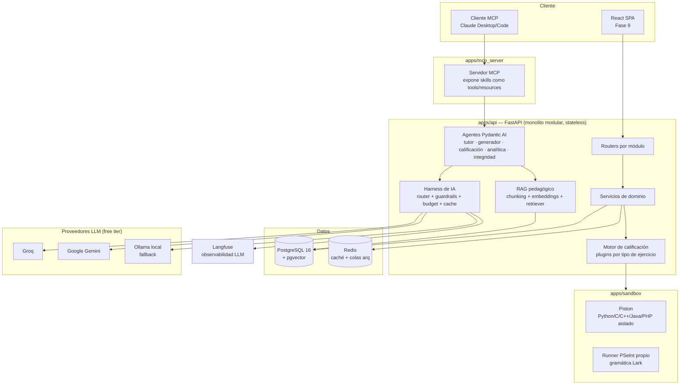

# Arquitectura

## Vista de componentes

## Principios

1. **Monolito modular stateless (RE-01)**: cada dominio (`users`, `groups`, `content`, `exercises`, `evaluations`, `grading`, `progress`, `reports`) vive en su propio módulo con capas `router → service → repository`. Nada de estado en memoria del proceso — todo estado compartido vive en Postgres o Redis, permitiendo escalar horizontalmente detrás de un balanceador sin cambios de código. Ver [ADR-001](adr/001-monolito-modular.md).
2. **Motor de ejercicios por plugins (RE-05)**: cada tipo de pregunta implementa un protocolo común `grade(exercise_version, answer) -> GradeResult`. Agregar un tipo nuevo no toca el motor existente.
3. **Harness de IA propio (§9.1)**: ninguna llamada a un LLM ocurre fuera de `ai/harness`. Se resuelve plantilla versionada → guardrails de entrada → enrutamiento con fallback → guardrails de salida → caché/presupuesto → traza de auditoría, en ese orden, siempre.
4. **Skills como única fuente de verdad**: las funciones en `ai/skills` son usadas simultáneamente por el motor de calificación, los agentes (como *tools*) y el servidor MCP (como *tools* remotas) — una sola implementación, tres consumidores.
5. **Human-in-the-loop obligatorio (RF-32, RF-33)**: todo contenido o calificación generado por IA nace en estado `draft`/`suggested` y requiere aprobación docente explícita antes de afectar a un estudiante.
6. **Multi-tenant desde el día 1 (RE-04)**: toda tabla de dominio incluye `institution_id`; el particionamiento lógico existe aunque hoy solo haya una sede.
7. **Aislamiento de ejecución de código**: nunca se ejecuta código de un estudiante en el proceso de la API — siempre a través de `apps/sandbox` (Piston para lenguajes compilados/Python, runner propio para PSeInt).
